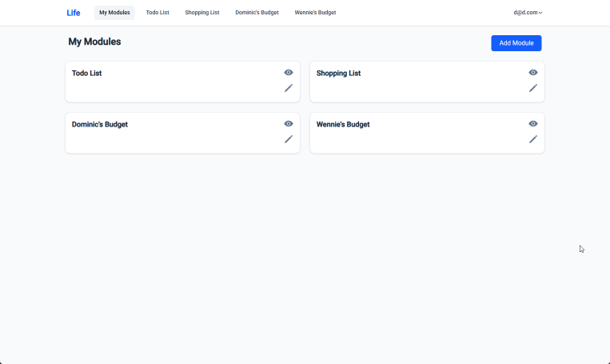
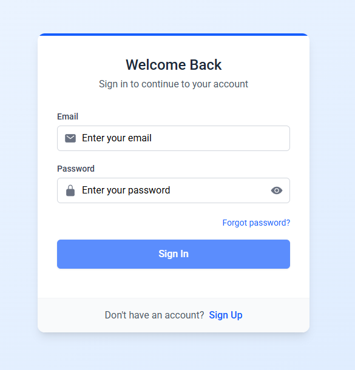
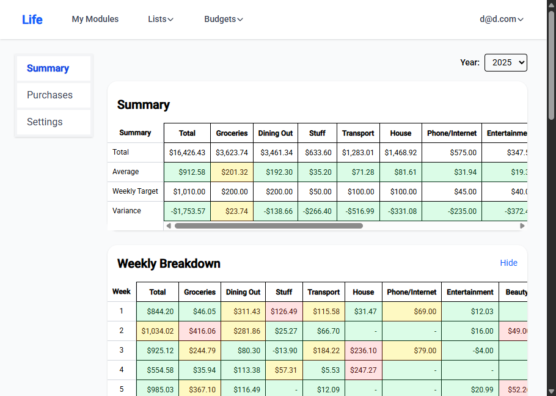
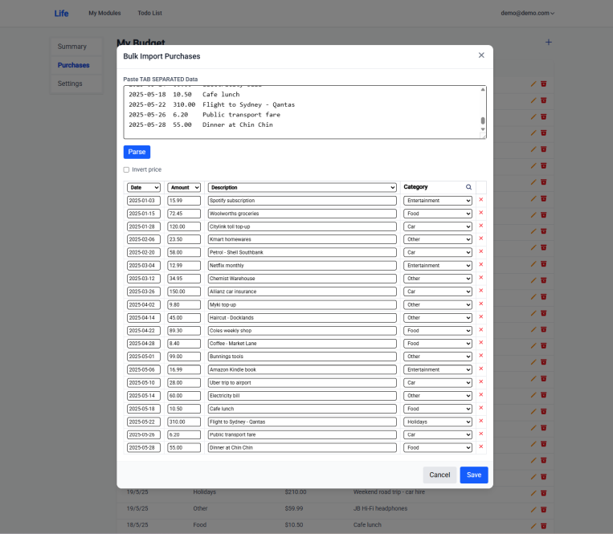
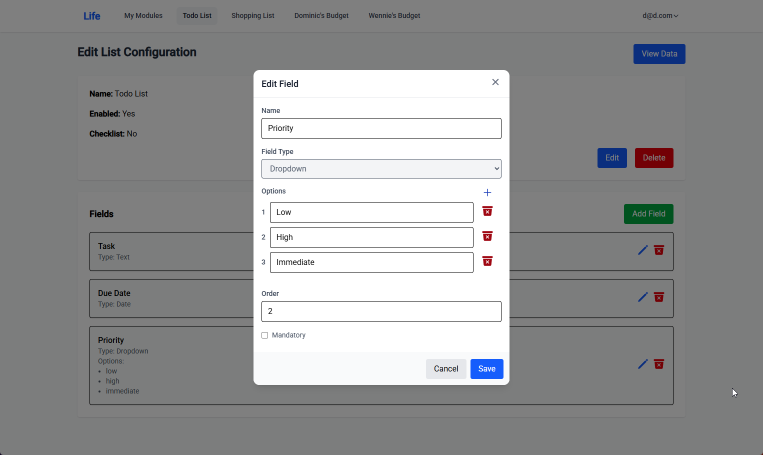
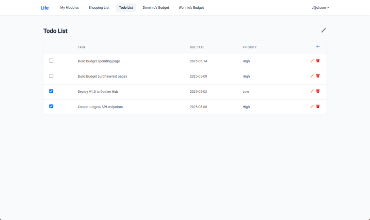

# Life App

> A modular personal management app built with Angular and Django Rest Framework.

## ✨ Overview

**Life App** is a personal dashboard with modular tools to help organise your digital life.

## 🔧 Features

- Modular architecture with support for dynamic modules
- Customisable **List Modules** (e.g., shopping lists, checklists)
- Powerful **Budget Module**:
  - Weekly budgets with category breakdowns
  - Quick-add and bulk import purchases
  - Category tracking and weekly summaries
  - Automatic categorisation of purchases
- User authentication with token-based access
- Responsive layout and mobile-friendly design
- Simple, clean interface built with TailwindCSS

## 🧪 Demo

You can try out the app live at:
🔗 [https://life.domsapps.com](https://life.domsapps.com)

## 🧱 Tech Stack

### Frontend

- **Framework:** Angular v19
- **Styling:** TailwindCSS with PostCSS
- **Icons:** `ng-icons` with Ionicons
- **Routing:** Angular Router with protected routes

### Backend

- **Language:** Python 3.12
- **Framework:** Django + Django REST Framework (DRF)
- **Database:** PostgreSQL
- **Auth:** JWT-based authentication
- **Swagger:** DRF Spectacular
- **Testing:** Django’s built-in test runner with `APITestCase` coverage
- **CORS & Security:** Configured for cross-origin requests and HTTPS deployments

## 📦 Setup Instructions

### 🔹 Backend (`LifeAPI`)

> **Note:** You’ll need a running PostgreSQL database before starting the backend.
> For local development, you can use Docker with the image: `postgres:17.2-alpine`.

~~~
cd Life/LifeAPI
python3 -m venv venv
source venv/bin/activate
pip install -r requirements.txt

# Create a database in PostgreSQL
# Set environment variables in a `.env` file (see .env.example for reference)

# Apply migrations and run the server
python3 manage.py migrate
python3 manage.py runserver

~~~

### 🔹 Frontend (`LifeUI`)

~~~
cd Life/LifeUI
npm install
npm start
~~~

Ensure the frontend is pointing to your backend API in `src/environments/environment.ts`.

## 🗺️ Roadmap

- ✅ v1.0 — List Module (basic CRUD)
- ✅ v1.1 — Budget Module
- ✅ v1.2 — Automatic Category Detection
- 🔜 Future: Notes, Calendar, Reminders, etc.

## 📷 Screenshots

> Budget Summary

> Budget Purchase Import

> List Configuration

> List Data

## 📄 License

MIT License
